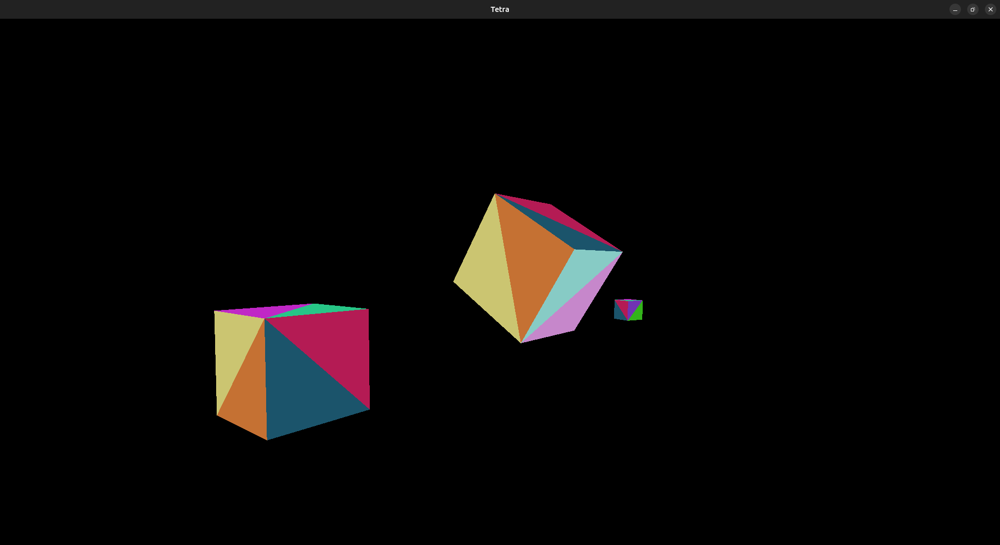

# Multiple files

There's multiple files because I'm defining some helper library crates. The main project is called "tetra".

I also included my WIP "bvh" project (it has a README), that challenges my understanding of coding for performance.

# Launch

Need :
- rustc (rust compiler)
- cargo (rust package, called "crate", manager)
- vulkan drivers

Download folder :

```bash
git clone https://github.com/CireTheBoos/project
```

Open terminal in "tetra" and type :

```bash
cargo run -r
```

This will compile every dependencies and launch the executable.
(`-r` for "release mode" as opposed to "debug mode" that contains additional checks)

**Press ESCAPE to focus/unfocus once window appears.**

# Project



Features :
- **Memos** : See inside "tetra/memos" for all my vulkan notes. I try to understand deeply every concepts.
- Per triangle rendering (currently using geometry shader but I will change for duplicate vertices + `gl_VertexID / 3`).
- Controls : Mouse + ZQSD + Shift/Space.
- Resizable window.
- Depth testing.
- Dynamic addition of meshes (cubes are added after renderer creation). No deletion or edit.
- Multi-Draw Indirect.
- Custom vulkan context (instance and device creation). I didn't know of Vulkan Bootstrap at the time.
- Memory management using VMA.
- Dynamic rendering instead of render passes.

Just a basic renderer for now, with premises of dynamic mesh edit.
