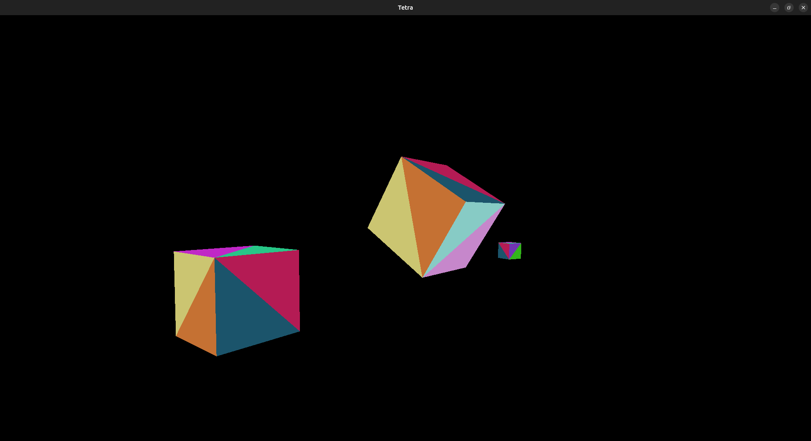

# Features

- **Memos** : Inside "memos" folder are all my vulkan notes. I try to understand deeply every concepts.
- Per triangle rendering (currently using geometry shader but I will change for duplicate vertices + `gl_VertexID / 3`).
- Controls : Mouse + ZQSD + Shift/Space + Escape.
- Resizable window.
- Depth testing.
- Dynamic mesh loading (screenshot cubes are added after renderer creation). No deletion or edit yet.
- Multi-Draw Indirect.
- Custom vulkan context (instance and device creation). I didn't know of Vulkan Bootstrap at the time.
- Memory management using VMA.
- Dynamic rendering instead of render passes.

Just a basic renderer for now, with premises of dynamic mesh edit.
